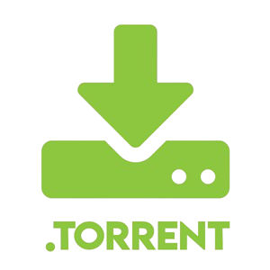
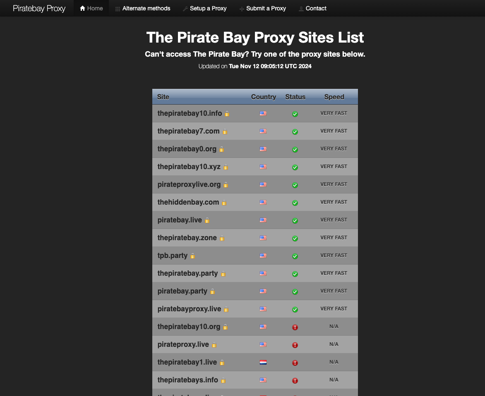
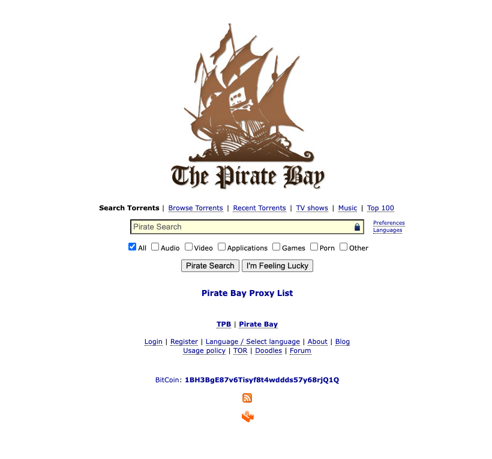
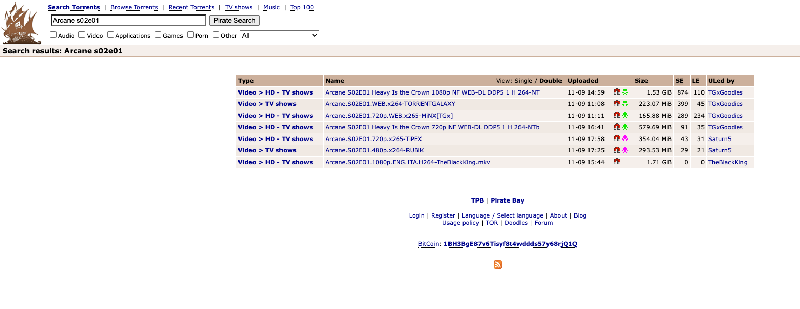
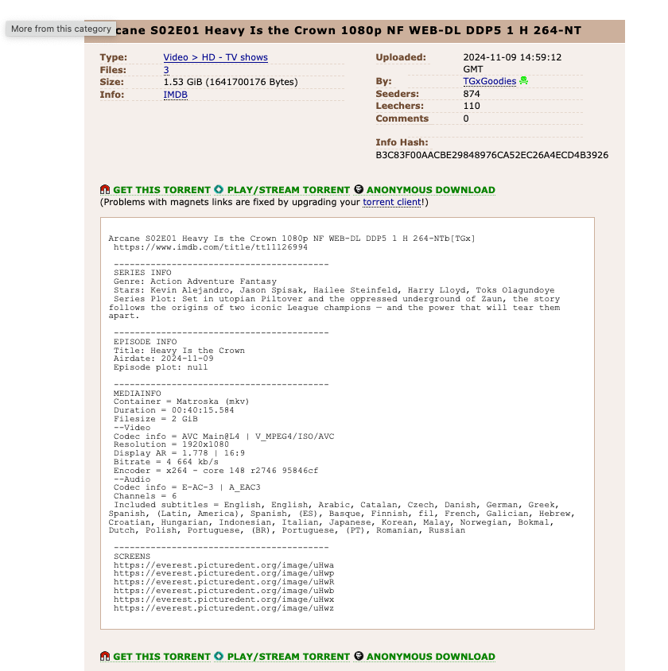
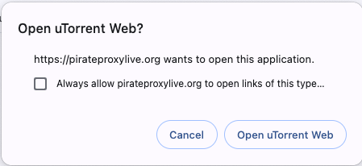

# Guía Básica para Descargar Series y Películas usando Torrents



Esta guía te ayudará a entender cómo funcionan los torrents y cómo puedes usarlos de manera segura para descargar series y películas utilizando programas como **uTorrent** o **qBittorrent**.

---

## 1. ¿Qué es un Torrent?

Un archivo `.torrent` contiene información sobre los archivos y carpetas que deseas descargar. 

En si, el archivo `.torrent` no contiene los datos que deseamos descargar, pero contiene la direccion (una computadra)
donde los datos que queremos descargar estan alojados.

También incluye los datos de las personas que están compartiendo esos archivos, permitiéndote descargar partes de ellos desde **distintas fuentes**.

**Conceptos clave:**
- **Torrent**: Archivo que contiene la/s direccion/es donde el archivo buscado se encuentra alojado.
- **Client**: El cliente nos permitira, por medio de un archivo torrent, descargar los archivos que estamos buscando.
- **Seeders**: Usuarios que ya tienen el archivo completo y lo están compartiendo con otros.
- **Leechers**: Usuarios que están descargando el archivo, pero que aún no tienen todas las partes. Una buena cantidad de seeders es importante para obtener descargas más rápidas y estables.

---

## 2. Instalación de un Cliente de Torrent

Para descargar archivos mediante torrents, necesitas un programa llamado "cliente". Si bien hay varios clientes para 
descargar `.torrent`, nos vamos a centrar en solo dos opciones

### Opción 1: uTorrent (Recomendado)


1. Visita [https://www.utorrent.com/](https://www.utorrent.com/).
2. Descarga e instala la versión gratuita.
3. Sigue las instrucciones de instalación.
   
 | Pros                     |                    Cons                     |
 |--------------------------|:-------------------------------------------:|
 | Interfaz Web             |                 Publicidad                  |
 | Soporte multi plataforma | Algunos problemas de seguridad en el pasado |


### Opción 2: qBittorrent 


1. Ve a [https://www.qbittorrent.org/](https://www.qbittorrent.org/).
2. Descarga la versión para tu sistema operativo.
3. Instálalo siguiendo las instrucciones.


| Pros            |               Cons                |
|-----------------|:---------------------------------:|
| Sin publicidad  | Menos amigable para principiantes |
| Codigo abierto  |    Menos funciones adicionales    |
| Liviano         |                                   |
| Multiplataforma |                                   |


---

## 3. Sitios Recomendados y Seguros para Descargar Torrents

Es importante descargar torrents solo de sitios confiables. Aquí tienes algunos de los sitios más seguros y confiables para encontrar series y películas:

- [Proxy Bay](https://piratebayproxy.info/) - **Mi preferido.** Contiene proxy-servers de The Pirate Bay alojados en distintos paises para mas compatibilidad regional 
- [1337x](https://1337x.to/) - Buena selección y diseño amigable.
- [YTS](https://yts.mx/) - Específico para películas, con excelente calidad.
- [LimeTorrents](https://www.limetorrents.info/) - Bastante confiable y con buen contenido.

> [!WARNING] 
> Algunos sitios de torrents pueden estar bloqueados en ciertas regiones. En esos casos, se recomienda usar una VPN.

---

## 4. Cómo Usar Torrents

Vamos a mostrar un ejemplo con [Proxy Bay](https://piratebayproxy.info/) dado que es mi favorita.

Al entrar en el sitio, nos encontraremos con los proxies funcionando actualmente 



Generalmente el sitio ordenara los proxies por estado y velocidad de descarga. 

En lo personal, nunca elijo los primeros que incluyen numeros (thepiratebay10.info, thepiratebay7.com, etc...). 
No tengo idea si son inseguros, es una cuestion de confianza.

Supongamos que elegimos [pirateproxylive.org](https://pirateproxylive.org/)



La busqueda es simple. Alcanza con buscar lo que estamos buscando.

> [!Note]
> Si estamos buscando series, es recomendado buscarlas por temporada entera (season) o por episodio (episode).
>
> Ej Temporada: Arcane S02
>
> Ej Episodio: Arcane S02E01



> [!Note]
> Es importante prestarle atencion a los nombres de los archivos, el peso de los mismos y los SE (seeders) y LE (leechers)

```Arcane S02E01 Heavy Is the Crown 1080p NF WEB-DL DDP5 1 H 264-NT```

Vamos a cliquear el primer resultado dado que es el que mayor Seeders tiene y es con buena calidad



Finalmente para descargar el torrent vamos a hacer click en `🧲 GET THIS TORRENT` 

Si ya tenemos instalado Utorrent, nos deberia aparecer un cartel en el navegador consultandonos si queremos abrir ese torrent con uTorrent



Cliqueemos en Always allow pirateproxylive.org y finalmente en Open UTorrent Web


Lo agregamos haciendo click en Add y esperamos hasta que termine de descargarse


Lo bueno de Utorrent es que podemos cerrar la pestaña y la descarga continuara. Podemos seguir chequeandola volviendo a abrir la pestaña.


Una vez terminada nuestra descarga, podemos abrir el archivo desde su carpeta. Tambien podemos reproducir la pelicula o serie desde UTorrent, 
pero el reproductor no es fantastico.


Mi recomendacion es usar [VLC](https://www.videolan.org/) para reproducir los archivos que descargamos

---

## 5. Consejos para Usar Torrents de Forma Segura

1. Chequear que el nombre este bien escrito
2. Que sea el capitulo o temporada que querramos
3. Que la calidad sea la que buscamos (1080p, 720p, etc..)
4. Que el peso del archivo tenga sentido (Si tenes un episodio que pesa 7kb, es un virus, fija). Chequeemos que esten siempre
  entre el orden de los 400 Mb y los 3 Gb (puede ser mas, pero no vas a notar la diferencia de calidad)
5. Que tenga la mayor cantidad de SE posible
6. En menor medida, que tenga la menor cantidad de LE (no es tan importante)
7. Si el sitio permite comentarios, chequear que los comentarios sean a favor de la descarga

---

## 6. Glosario Rápido

- **Cliente de Torrent**: Programa que permite descargar archivos mediante torrents (ej. uTorrent, qBittorrent).
- **Seeder**: Persona que comparte un archivo completo.
- **Leecher**: Persona que descarga un archivo pero aún no lo tiene completo.
- **Magnet Link**: Enlace directo para iniciar la descarga de un torrent sin necesidad de un archivo `.torrent`.

---

## 7. Software adicional recomendado
- [VLC](https://www.videolan.org/): Reproductor de media. Permite formato `.mkv` y es versatil y liviano
- [Winrar](https://www.win-rar.com/start.html?&L=0): Compresor y descompresor de archivos. A veces lo vamos a necesitar
